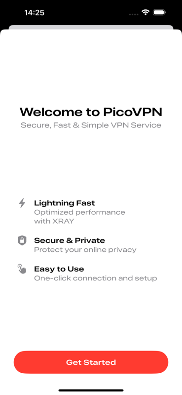
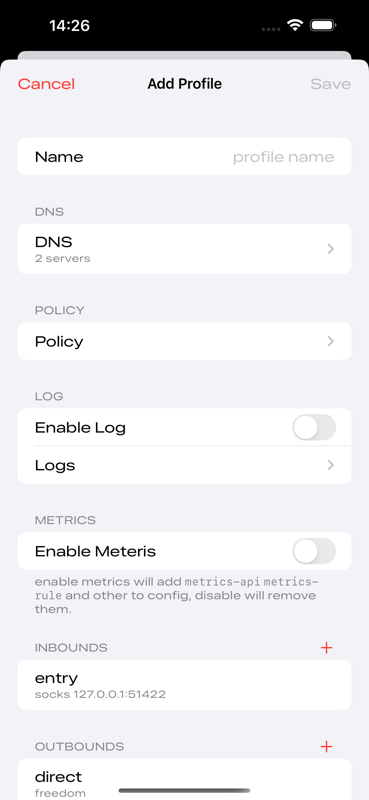
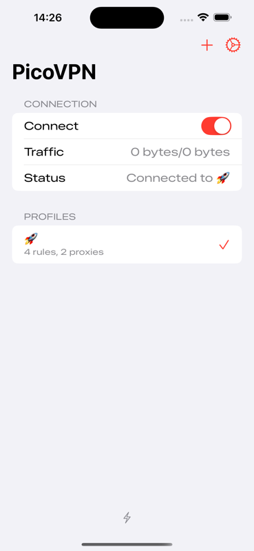
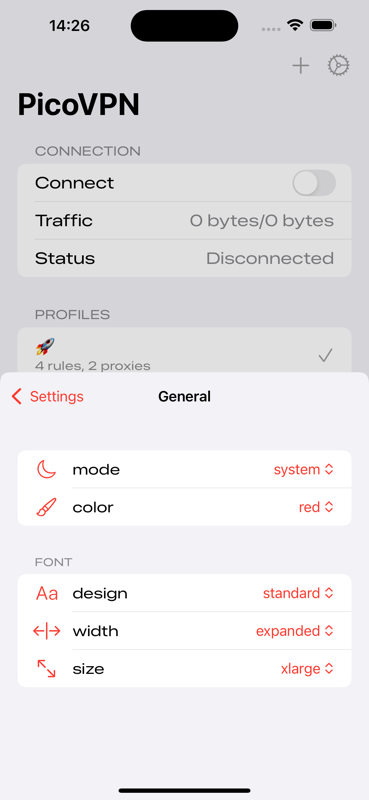
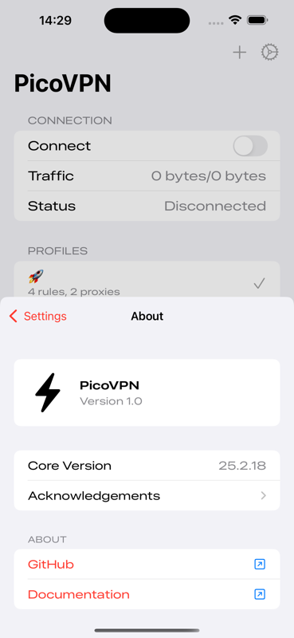

<h1 align="center">
  
   PicoVPN 
</h1>

  <em>⚡️ PicoVPN is an iOS VPN client powered by Xray-core and NetworkExtension framework. It provides a lightweight and efficient VPN solution for iOS devices.</em>
   
  

----

## Features

- Built on Xray-core engine
- Integrated with Apple's NetworkExtension framework
- Multiple proxy protocol support
- Clean and intuitive user interface
- Stable connection performance
- Low memory footprint

## Screenshots

<table>
<tr>
<td></td>
<td></td>
<td></td>
<td></td>
<td></td>
</tr>
</table>

## License

This project is licensed under the [GPLv3 license and specific limitations](https://github.com/lsongdev/.github/blob/main/LICENSE.md).

本项目没有在 App Store 上架, 也禁止任何人将本项目发布到 App Store, 代码仅供研究学习使用, 禁止任何未授权的商业行为。